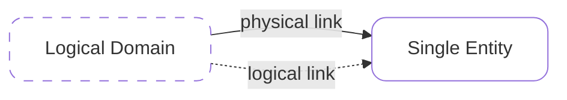
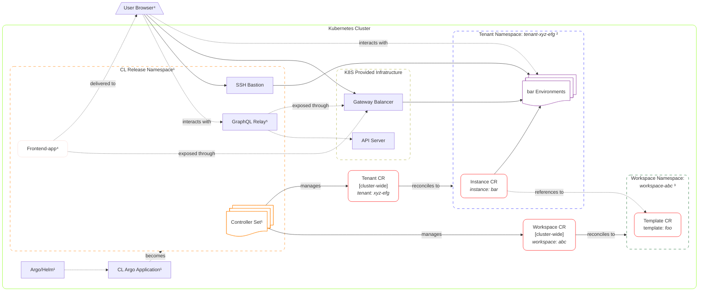

### Mermaid Legend:

# CrownLabs Big Picture
The following will be placed in **home**

¹More about Deployment+Gateway [here](BIGPICTURE.md#crownlabs-deployment).  
²More about Tenant [here](BIGPICTURE.md#tenant-business-logic).  
³More about Workspace [here](BIGPICTURE.md#workspace-business-logic).  
⁴More about Frontend [here](BIGPICTURE.md#frontend-logic)  
⁵More about QLKube  

