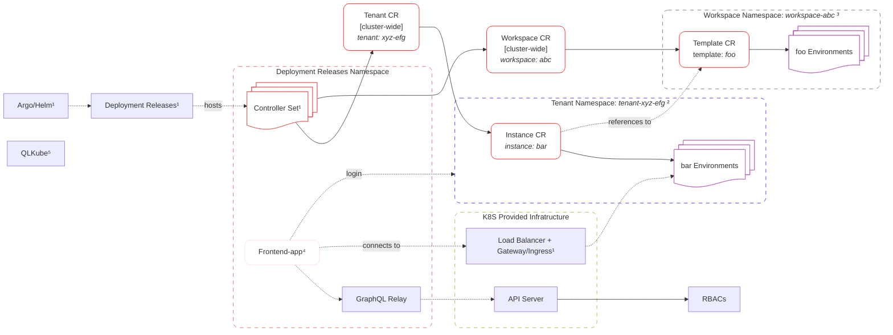
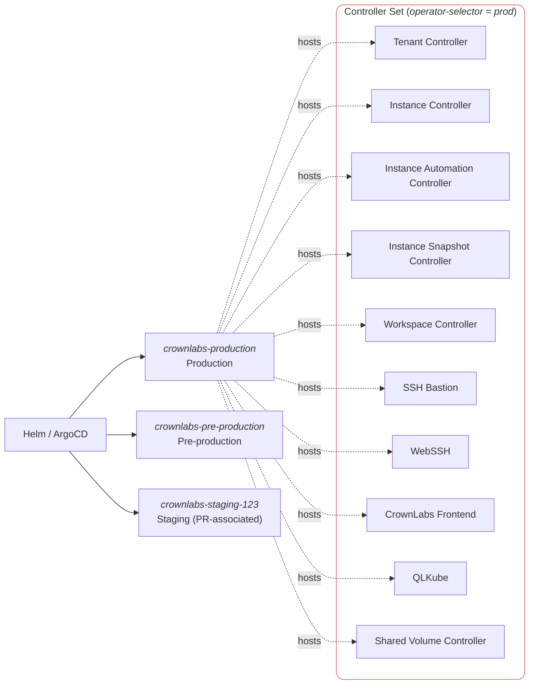
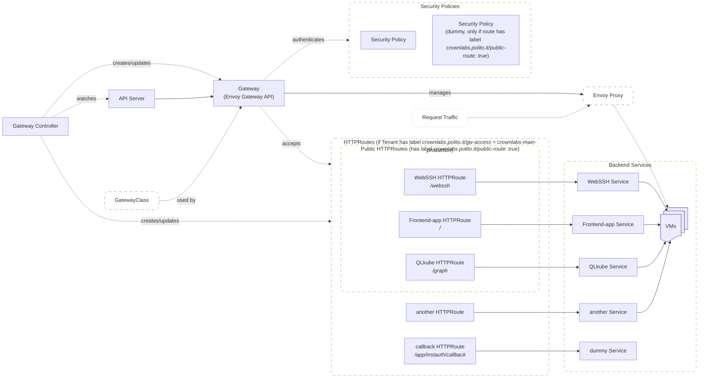
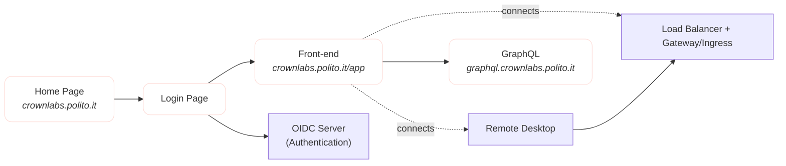
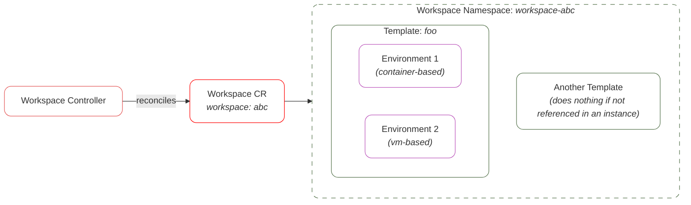
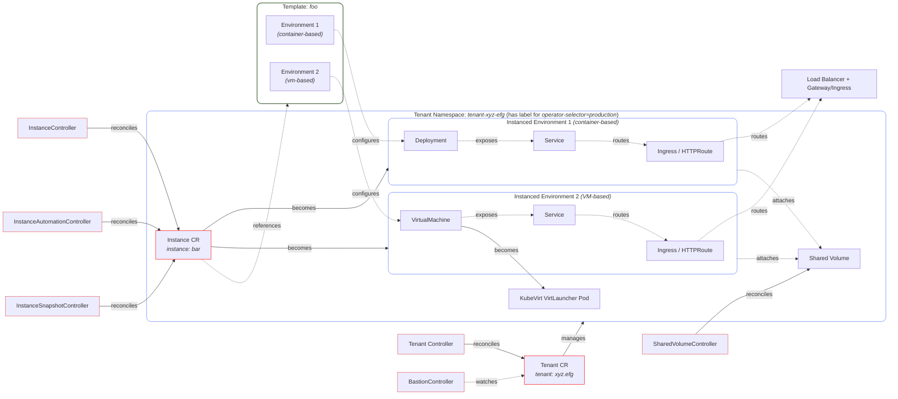

### Mermaid Legend:

```mermaid
%% ==== OVERVIEW GRAPH ====
flowchart TB

LogicalDomain
Controller
Workspace
CRD
Tenant
Environment
Frontend

%% General Class Definitions - Border Styles (BS)
classDef GenericDashedBS fill:none,rx:12,ry:12,stroke-dasharray:8
classDef ControllerBS stroke:#E45756,rx:12,ry:12,fill:none
classDef WorkspaceBS stroke:#54724B,rx:12,ry:12,fill:none
classDef CustomResourceBS stroke:#FF0000,rx:12,ry:12,fill:none
classDef TenantBS stroke:#2222FF,rx:12,ry:12,fill:none
classDef EnvironmentBS stroke:#BB55BB,rx:12,ry:12,fill:none
classDef FrontendBS stroke:#FDDCD7,rx:12,ry:12,fill:none

%% Class Applications
class LogicalDomain GenericDashedBS
class Controller ControllerBS
class Workspace WorkspaceBS
class CRD CustomResourceBS
class Tenant TenantBS
class Environment EnvironmentBS
class Frontend FrontendBS
```

# CrownLabs Big Picture
The following will be placed in **home**

¹More about Deployment+Gateway [here](BIGPICTURE.md#crownlabs-deployment).  
²More about Tenant [here](BIGPICTURE.md#tenant-business-logic).  
³More about Workspace [here](BIGPICTURE.md#workspace-business-logic).  
⁴More about Frontend [here](BIGPICTURE.md#frontend-logic)  
⁵More about QLKube  

## CrownLabs Deployment Releases
The following will be placed in **home/deploy/crownlabs**

## Frontend Logic
The following will be placed in **home/frontend-app**

## Workspace Business Logic
The following will be placed in **home/operators/operator/workspace**

## Tenant Business Logic
The following will be placed in **home/operators/operator/tenant**

