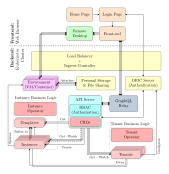

<!-- markdown-link-check-disable -->

<!-- markdown-link-check-enable -->

# CrownLabs

CrownLabs is a set of services designed to deliver **remote computing labs** through **per-user environments**, based either on virtual machines or lightweight containers.

Instructors can provision a set of environments (e.g., VMs), properly installed with the software required for a given lab (e.g., compilers, simulation software, etc).

Each student can connect to its own set of (remote) private environments without requiring any additional software, just a simple Web browser. No space problems on the student hard disk, no troubles in setting up the environment required to support multiple subjects on the same machine, and more.

In addition, each student can share his remote desktop with his groupmates, enabling multiple students to complete their labs in a team.

Finally, CrownLabs supports also instructors, who can connect to the remote desktop of the student and play directly with his environment, e.g., in case some help is required.

For more information, visit the CrownLabs website ([https://crownlabs.polito.it](https://crownlabs.polito.it)) and download our [scientific paper](https://ieeexplore.ieee.org/document/9136697) published in IEEE Access.

## Architecture

CrownLabs relies on two major high-level components:
* **The Backend Business Logic**, which provides the different CrownLabs functionalities and is implemented by custom Kubernetes operators (e.g. the Instance Operator);
* **qlkube**, a middleware that can expose the Kubernetes API Server as a GraphQL service;
* **The Frontend Dashboard**, which interacts with the Kubernetes API Server through _qlkube_ and exposes the different CrownLabs custom resources through a graphical interface.

A high-level representation of the main architectural building blocks composing CrownLabs is given by the following figure.
Please notice that, for the sake of clarity, the figure depicts only the most important elements for the provision of the actual service (i.e., remote computing labs), while omitting low-level components and the ones associated with the cluster operation (e.g monitoring).

## Backend Business Logic

The backend business logic providing the different CrownLabs functionalities is implemented by custom Kubernetes operators, while the data model is defined by means of CRDs.
Specifically, the main backend components are:

* the **Instance Operator**, which implements the logic to spawn new environments starting from predefined templates;
* the **Tenant Operator**, which automates the management of CrownLabs users (i.e. tenants) and groups (i.e. workspaces);
* the **Bastion Operator**, which configures an SSH bastion to provide command-line access to the environments instead of the web-based GUI.

Furthermore, some additional components are leveraged to simplify and automate companion tasks, such as listing the available images and deleting stale environments.

For more information regarding the CrownLabs backend, as well as for the deployment and configuration instructions, please refer to the corresponding [README](./operators/README.md).

## Frontend Dashboard

The frontend dashboard is the component responsible for providing access to the CrownLabs custom resources through an easy to use graphical interface.
It allows final users to explore the workspaces they are enrolled in, spawn new environments, and connect to their instances.
Additionally, privileged users can create, update and delete both templates and tenant resources, effectively managing the available environments and the permissions granted to access the system.
Authentication is managed through an external OIDC identity provider integrated with Kubernetes, while the authorizations to access specific resources are granted leveraging the Kubernetes RBAC approach.

# Installation

## Preliminary Note

CrownLabs can be installed on any Kubernetes cluster, although with a non-negligible degree of adaptation.
This would require a non-trivial knowledge of how Kubernetes (and the wonderful world of microservices) works.
No magic install procedure is unfortunately available (yet).

In a nutshell, you have to install all the components with your own custom configuration files, which may largely depend upon your physical install.
A huge degree of customization is possible in this respect: pure data-link vs. BGP-based load balancing, the number (and capabilities) of your servers, the desired degree of high availability, integration with external authentication servers, creation of admin/user credentials, your own secrets to protect the internal communication among the components.

Do not expect to complete this task in a few hours; likely, you may need several days, or even more.
Help is available on our Slack channels.
For more information, visit the CrownLabs website: [https://crownlabs.polito.it](https://crownlabs.polito.it).

## Pre-Requirements

Crownlabs has been specifically designed for bare-metal clusters and this assumption will be adopted across the documentation. To deploy CrownLabs, we have to rely on a full-fledged Kubernetes cluster where at least a subset of nodes supports Hardware Virtualization.
In [infrastructure](infrastructure/), we present all the services which should be installed on the cluster, with an example of configuration. We strongly suggest to set up on your cluster the same components that we used, in order to avoid feature mismatch.

## Deploying the CrownLabs components

The deployment and configuration of the different CrownLabs components can be performed leveraging the provided Helm Chart.
Please, refer to the corresponding [README](./deploy/crownlabs/README.md) file for more information about the installation procedure.
