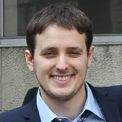
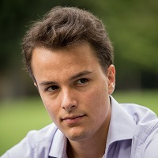
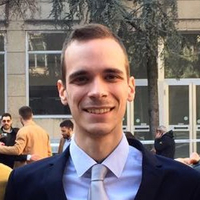
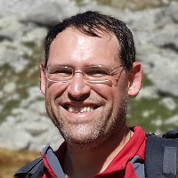
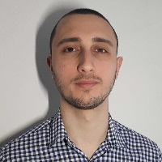
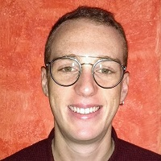
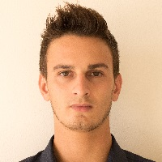

# CrownLabs

CrownLabs is a set of services that enable to remotize computing labs.

Professors can provision a set of virtual machines, properly equipped with the software required for a given lab (e.g., compilers, simulation software, etc).
Each student can connect to its own set of (remote) virtual machines, simply through a browser.

Each student will get his own private environment without requiring to install any additional software but a simple Web browser.
Optionally, a student can share his remote desktop with his groupmates, enabling multiple students to complete their duties in team.
Also professors can connect to the remote desktop of the student and interact with his virtual machines, e.g., in case some help is required.

Students have full control of the lifecycle of their VMs (e.g., start, stop, reboot). Access is secured and protected through encrypted sessions.

## Technology
This service builds upon many Kubernetes elements, with the addition of some our own glue logic.
Although Kubernetes was designed for containers and not for virtual machines, we choose that platform because is very scalable, has many built-in features (e.g., autoscaling), is extendible (CRDs), and features an incredible ecosystem of companion services. And, last but not least, is *cool* and provides more *fun* to our team.

To deliver our services, we leverage several components in the Kubernetes ecosystem:
- **Kubevirt**, as a platform for virtualization
- **Keycloak**, an OIDC provider for authentication and authorization
- **nginx**, as ingress controller
- **Prometheus**, for monitoring and alerting
- **Grafana**, as dashboard
- **Rook**, for distributed storage
- **CoreDNS**, to resolve names into addresses within the cluster
- **External DNS** (with bind9), to resolve public IP addresses into names
- **Docker Registry**, to keep local the traffic required to download the VMs
- **MetalLB**, as (software) load balancer

In addition, we leverage the usual mixture of `bash`, `ansible`, Docker, Python and Go to create our glue logic.

## History
This service was set up in about three weeks by a group of students enrolled in the MSc of Computing Engineering at Politecnico di Torino, under the pressure of the Coronavirus, in March 2020.

This virus hit hard the entire country; all students were sent home, the University set up private video conferencing servers in a few days, and classes were transformed into remote lectures.

However, there was no answers for labs, in particular computing labs. How can students practice with their coding labs, simulations, cloud, networking?
To answer this question, the CrownLabs project brought together a group of volunteering students who decided to put their theorethical knowledge into practice.
It was a wonderful ride: creating the team, sharing the knowledge owned by different people, defining the objectives, assigning the tasks, a lot of collaboration, a lot of day and night work.

The result was a nice playground for everybody: we demonstrated that with the proper knowledge, team spirit, and a great extent of sacrifice, we can achieve great results.
And, we started this project, which may be useful also outside the University.

## People
Given the way this project was set up at the beginning, it is worth mentioning all the people who spend their nights on it.

Aldo Lacuku, "To authenticate, you have to come to me". He really knows about security. He also knows the boss of the hosting room, which was very helpful indeed.

Alex Palesandro, The true leader, manager, developer, tester. Nothing can be done without him.

Andrea Cossio, "I know how to connect to the VM". He knows VNC more than the actual developers.

Francesco Borgogni, "Kubernetes CRDs are my future". Give him to a CRD to create, code will come in minutes.

Fulvio Risso, project leader, tester. Nobody knows what he does. Always in some calls.

Giuseppe Ognibene, "Give me a probe, and I'll dominate the world". Prometheus can never relax, with Giuseppe around.

Hamza Rhaouati, "Divide et impera". With him, you don't have to worry about scalability.

Marco Iorio, "No words, only facts". Whatever he does (silently), you can be sure that it will be perfect.

Mattia Lavacca, "I want to start a PhD!". Instead, he did CI/CD in a magnificent way. Not really a topic for PhD students.

Serena Flocco, "I don't have Internet at home, how can I create the GUI?". Really hard to work when forced to stay home, without Internet. Ladies have always a better taste than (male) engineers.

Simone Magnani, Frontend developer, "I'll do also what I don't  like at all" (GUIs). Active day and night.

Stefano Galantino, "To enter, you have to pass on my body". He is the only one who knows about Kubernetes ingress controllers.

