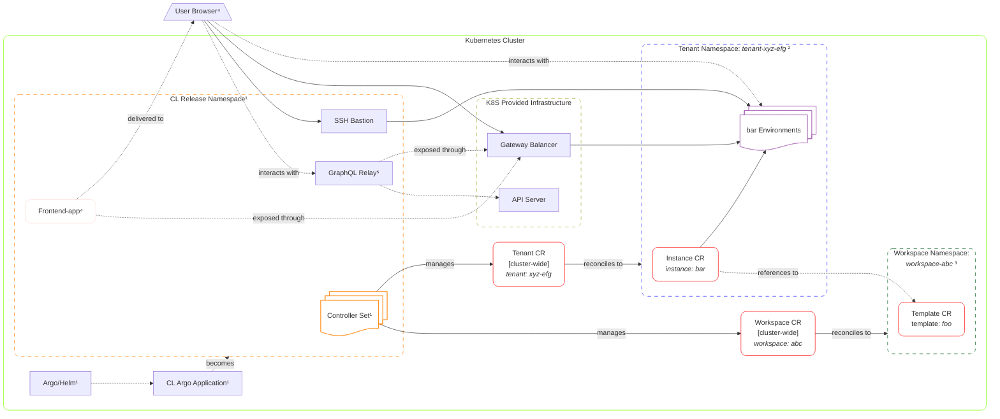
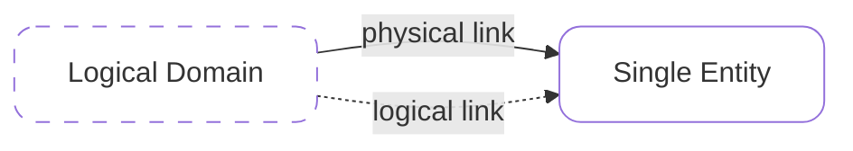

<!-- markdown-link-check-disable -->

<!-- markdown-link-check-enable -->

# CrownLabs

CrownLabs is a set of services designed to deliver **remote computing labs** through **per-user environments**, based either on virtual machines or lightweight containers.

Instructors can provision a set of environments (e.g., VMs), properly installed with the software required for a given lab (e.g., compilers, simulation software, etc).

Each student can connect to its own set of (remote) private environments without requiring any additional software, just a simple Web browser. No space problems on the student hard disk, no troubles in setting up the environment required to support multiple subjects on the same machine, and more.

In addition, each student can share his remote desktop with his groupmates, enabling multiple students to complete their labs in a team.

Finally, CrownLabs supports also instructors, who can connect to the remote desktop of the student and play directly with his environment, e.g., in case some help is required.

For more information, visit the CrownLabs website ([https://crownlabs.polito.it](https://crownlabs.polito.it)) and download our [scientific paper](https://ieeexplore.ieee.org/document/9136697) published in IEEE Access.

## Architecture

CrownLabs is organized around Kubernetes namespaces and the resources managed within them. Its architecture comprises some main scopes:

* the **CL release namespace**, which contains the controllers and platform services, including the frontend, GraphQL relay, and SSH bastion;
* **workspace namespaces**, which contain the templates used to define computing environments;
* **tenant namespaces**, which contain the instances and environments made available to each tenant.

Cluster-wide `Workspace` and `Tenant` resources connect these scopes. Controllers reconcile them into their corresponding namespaces, while instances reference workspace templates and create the environments used by students and instructors. _QLKube_ acts as the GraphQL relay through which the dashboard accesses the Kubernetes API Server. The gateway and SSH bastion provide access to the resulting environments.

The namespace-oriented model focuses on the principal components required to provide remote computing labs. It omits low-level components and services associated with cluster operation, such as monitoring.

```mermaid
flowchart LR

User@{shape: trap-b, label: "User Browser⁴"}

subgraph Cluster["Kubernetes Cluster"]
    %% Cells
    Argo["Argo/Helm¹"]
    Release["CL Argo Application¹"]

    %% subgraphs
    subgraph ReleaseNS["CL Release Namespace¹"]
        Controllers@{shape: docs, label: "Controller Set¹"}
        Frontend["Frontend-app⁴"]:::FrontendStyle
        GraphQL["GraphQL Relay⁵"]
        Bastion["SSH Bastion"]
    end
    WorkspaceCR["`Workspace CR
        [cluster-wide]
        _workspace: abc_`"]:::CustomResourceStyle
    Controllers -- manages --> WorkspaceCR
    subgraph WorkspaceNS["`Workspace Namespace:
    _workspace-abc_ ³`"]
        direction LR
        TemplateCR["`Template CR
            template: _foo_`"]:::CustomResourceStyle
    end
    TenantCR["`Tenant CR
        [cluster-wide]
        _tenant: xyz-efg_`"]:::CustomResourceStyle
    subgraph TenantNS["`Tenant Namespace: _tenant-xyz-efg_ ²`"]
        InstanceCR["`Instance CR
            _instance: bar_`"]:::CustomResourceStyle
        InstanceEnv@{shape: docs, label: "bar Environments"}

    end
    subgraph K8S["K8S Provided Infrastructure"]
        APIServer["API Server"]
        GWAPI["Gateway Balancer"]
    end
end

Controllers -- manages --> TenantCR
Argo .-> Release
Release -. becomes .-> ReleaseNS
Frontend -. exposed through .-> GWAPI
Frontend -. delivered to .-> User
GraphQL .-> APIServer
GWAPI ---> InstanceEnv
WorkspaceCR -- reconciles to --> WorkspaceNS
TenantCR -- reconciles to --> TenantNS
User --> GWAPI
User -. interacts with .-> GraphQL
User -. interacts with .-> InstanceEnv
InstanceCR -. references to ..-> TemplateCR
InstanceCR --> InstanceEnv
GraphQL -. exposed through .-> GWAPI
User --> Bastion
Bastion  --> InstanceEnv

classDef ControllerStyle stroke:#FF8000,rx:12,ry:12,fill:none
classDef WorkspaceStyle stroke:#0A6522,rx:12,ry:12,fill:none
classDef CustomResourceStyle stroke:#FF0000,rx:12,ry:12,fill:none
classDef TenantStyle stroke:#2222FF,rx:12,ry:12,fill:none
classDef EnvironmentStyle stroke:#A865B5,rx:12,ry:12,fill:none
classDef FrontendStyle stroke:#FDDCD7,rx:12,ry:12,fill:none
classDef ClusterStyle stroke:#80FF00,rx:12,ry:12,fill:none

classDef GenericDomainStyle fill:none,rx:12,ry:12,stroke-dasharray:8
classDef WorkspaceNSStyle stroke:#0A6522,rx:12,ry:12,fill:none,stroke-dasharray:8
classDef TenantNSStyle stroke:#2222FF,rx:12,ry:12,fill:none,stroke-dasharray:8
classDef ReleaseNSStyle stroke:#FF8000,rx:12,ry:12,fill:none,stroke-dasharray:8

class K8S GenericDomainStyle
class ReleaseNS ReleaseNSStyle
class Controllers ControllerStyle
class WorkspaceNS WorkspaceNSStyle
class InstanceEnv EnvironmentStyle
class TenantNS TenantNSStyle
class Cluster ClusterStyle
```
¹More about the deployment [here](deploy/crownlabs/README.md).  
²More about Tenant soon.  
³More about Workspace soon.  
⁴More about Frontend [here](frontend/README.md)  
⁵More about QLKube [here](qlkube/README.md).  

### Graph Legend:

Dashed borders represent logical domains such as namespaces or infrastructure groups; solid borders represent individual entities.  
Solid arrows show physical or operational links, while dashed arrows show logical relationships.

```mermaid
%% ==== OVERVIEW GRAPH ====
flowchart LR


Domain["Logical Domain"]:::DomainStyle
Entity["Single Entity"]:::EntitySyle

Domain -- physical link --> Entity
Domain -. logical link .-> Entity

classDef DomainStyle rx:12,ry:12,fill:none,stroke-dasharray:8
classDef EntitySyle rx:12,ry:12,fill:none
```

## Controllers and Resource Management

CrownLabs functionalities are implemented by custom Kubernetes operators, while the data model is defined by means of Kubernetes Custom Resource Definitions (CRDs). These operators reconcile cluster-wide and namespace-scoped resources across the namespace-oriented architecture.
The main controllers are:

* the **Instance Operator**, which implements the logic to spawn new environments starting from predefined templates;
* the **Tenant Operator**, which automates the management of CrownLabs users (i.e. tenants) and groups (i.e. workspaces);
* the **Bastion Operator**, which configures an SSH bastion to provide command-line access to the environments instead of the web-based GUI.

Furthermore, additional components simplify and automate companion tasks, such as listing the available images and deleting stale environments.

For more information about the operators, as well as deployment and configuration instructions, please refer to the corresponding [README](./operators/README.md).

## User Access

The frontend dashboard, exposed through the release namespace, provides access to CrownLabs resources through an easy-to-use graphical interface.
It allows users to explore the workspaces they are enrolled in, spawn new environments in tenant namespaces, and connect to their instances.
Privileged users can also create, update, and delete templates and tenant resources, managing the environments and permissions available across the workspace and tenant namespaces.
Authentication is managed through an external OIDC identity provider integrated with Kubernetes, while the authorizations to access specific resources are granted leveraging the Kubernetes RBAC approach.

# Installation

## Preliminary Note

CrownLabs can be installed on any Kubernetes cluster, although with a non-negligible degree of adaptation.
This would require a non-trivial knowledge of how Kubernetes (and the wonderful world of microservices) works.
No magic install procedure is unfortunately available (yet).

In a nutshell, you have to install all the components with your own custom configuration files, which may largely depend upon your physical install.
A huge degree of customization is possible in this respect: pure data-link vs. BGP-based load balancing, the number (and capabilities) of your servers, the desired degree of high availability, integration with external authentication servers, creation of admin/user credentials, your own secrets to protect the internal communication among the components.

Do not expect to complete this task in a few hours; likely, you may need several days, or even more.
Help is available on our Slack channels.
For more information, visit the CrownLabs website: [https://crownlabs.polito.it](https://crownlabs.polito.it).

## Pre-Requirements

Crownlabs has been specifically designed for bare-metal clusters and this assumption will be adopted across the documentation. To deploy CrownLabs, we have to rely on a full-fledged Kubernetes cluster where at least a subset of nodes supports Hardware Virtualization.
In [infrastructure](infrastructure/), we present all the services which should be installed on the cluster, with an example of configuration. We strongly suggest to set up on your cluster the same components that we used, in order to avoid feature mismatch.

## Deploying the CrownLabs components

The deployment and configuration of the different CrownLabs components can be performed leveraging the provided Helm Chart.
Please, refer to the corresponding [README](./deploy/crownlabs/README.md) file for more information about the installation procedure.

# CrownLabs run-time configuration

Crownlabs has several components, mostly operators, which may need to be configured with appropriate labels and/or other information in order to achieve the intended behaviour.

The [Operators/docs](operators/docs/) section of the documentation presents the possible configuration options for the most important components.
