# CrownLabs Operators

This folder contains the different components that constitute the server-side of the CrownLabs business logic. Specifically, they are either Kubernetes operators or stand-alone components which interact with Kubernetes resources.

## How to deploy

To simplify the deployment and the configuration of the different components, CrownLabs leverages an [Helm](https://helm.sh/) chart.
More details about the chart and the entire deployment process are available in the [CrownLabs deployment README](../deploy/crownlabs/README.md).
The following instructions, instead focus on the deployment of a single operator, for development/testing purposes.

### Pre-requirements (instance-operator only)

The only external requirement of the instance-operator is KubeVirt, which is responsible for the management of virtual machines on top of a Kubernetes cluster.
Please, refer to the corresponding [README](../infrastructure/virtualization/README.md), for more information about the installation process.

### Install the CRDs

Before deploying the CrownLabs operators, it is necessary to install the different required CRDs. This can be done manually:

```bash
kubectl apply -f deploy/crds
```

or through the Makefile:

```bash
make install
```

### Deploy the CrownLabs operators

Thanks to the modularity of the Helm charts, it is possible to deploy each operator independently.
The following guide focuses on the instance-operator, but it can be trivially adapted to the other components.

First, it is necessary to configure the different parameters (e.g. number of replicas, URLs, credentials, ...), depending on the specific set-up.
In particular, this operation can be completed creating a copy of the [default configuration](deploy/instance-operator/values.yaml), and customizing it with the suitable values.
It is suggested not to edit the configuration in-place, to avoid checking it out inadvertently in the versioning system.

Then, it is possible to proceed with the deployment/upgrade of the instance-operator:

```bash
# Get the version to be deployed (e.g. the latest commit on master)
git fetch origin master
VERSION=$(git show-ref -s origin/master)

# Perform the instance-operator installation/upgrade
helm upgrade crownlabs-instance-operator deploy/instance-operator \
  --install --create-namespace \
  --namespace crownlabs-instance-operator \
  --values path/to/configuration.yaml \
  --set version=${VERSION}
```

## Instance Operator

Based on [Kubebuilder 2.3](https://github.com/kubernetes-sigs/kubebuilder.git), the operator implements the environment creation logic of CrownLabs.

The next picture shows the general architecture of the Instance Operator.
On the left you can see the controller (in blue) and the two CRDs used to describe the desired status (in green) and better detailed below. On the right it is possible to view the set of resources that are created for each environment. It is divided into two parts, one representing the components that are created only in the persistent case (that will be analyzed in the _Persistent Feature_ section), while the other one is the set of resources created in both scenarios (i.e. the VirtualMachine Instance itself and the components useful to connect to it, e.g. secret, service and ingress).




Upon the creation of a *Instance*, the operator triggers the creation of the following components:
* Kubevirt VirtualMachine Instance and the logic to access the noVNC instance inside the VM (Service, Ingress)
* An instance of [Oauth2 Proxy](https://github.com/oauth2-proxy/oauth2-proxy) (Deployment, Service, Ingress) to regulate access to the VM.
*  A [DataVolume](https://github.com/kubevirt/containerized-data-importer/blob/main/doc/datavolumes.md) (only in case of persistent VMs). It wraps a Persistent Volume Claim (PVC), and takes care of initializing it with the content of the selected VM image through an importer pod.

All those resources are bound to the Instance life-cycle via the [OwnerRef property](https://kubernetes.io/docs/concepts/workloads/controllers/garbage-collection/)


### APIs/CRDs

The Instance Operator implements the backend logic necessary to spawn new environments starting from a predefined template. The operator relies on two Kubernetes Custom Resource Definitions (CRDs) which implement the basic APIs:

- **Template** defines the size of the execution environment (e.g.; Virtual Machine), its base image and a description. This object is created by managers and read by users, while creating new instances.
- **Instance** defines an instance of a certain template. The manipulation of those objects triggers the reconciliation logic in the operator, which creates/destroy associated resources (e.g.; Virtual Machines).
- **InstanceSnapshot** defines a snapshot for a persistent VM instance. The associated operator will start the snapshot creation process once this resource is created.

### Persistent Feature

The Instance Operator enables the creation of persistent Virtual Machines (VM), i.e., VMs that can be stopped and restarted, deleted and recreated while keeping all the modifications done on the VM image disk.
In order to use this feature, [the CDI operator](../infrastructure/virtualization/README.md) has to be installed.

Provided that the CDI Operator has been deployed, the Instance Operator spawns a persistent VM similarly to a normal (i.e. non-persistent) one. To this end, the selection about which kind of VM is wanted, i.e. persistent or not, is performed looking at the corresponding field in the `template` spec. In the same way you can choose the size of the persistent disk that the VM will have.

Focusing on the resources created by the controller, it is worth highlighting that in the persistent case the Instance Operator instantiates a KubeVirt VirtualMachine object instead of a simple VirtualMachineInstance one. Indeed, this design choice allows to delegate the start and stop process of a VM to KubeVirt itself. Hence, a persistent VM can be easily stopped and started again modifying the `running` field of the Instance resource (optionally through the graphical user interface).

It is important to notice that the Instance Operator has to watch not only Instance resources but also the DataVolumes associated to them. In other words when an Instance or a DataVolume is modified, the controller is triggered and it starts a reconcile process in order to achieve a consistent state in the cluster. Since only one specific change in the DataVolume is important (i.e., when the status Phase becomes Succeeded) and a lot of changes in the Instance do not need controller actions (e.g., those affecting the status) a [Predicate](https://sdk.operatorframework.io/docs/building-operators/golang/references/event-filtering/) has been used. That function acts before the reconcile, working as a filter and letting the reconcile function be called only in the cases explained before.

Focusing now on the operator workflow, once the Instance is deployed, the controller starts creating a DataVolume, which triggers the CDI controller that generates two resources: the PVC and the importer pod.
The PVC represents a request for a PersistentVolume (PV). In other words thanks to the PVC a persistent disk is created and reserved for the VM.

The aim of the importer pod is to extract an image (in this case from a docker registry where it is saved) and load it inside the PVC. This process, depending on the size of the image, can take some minutes. Once the import is completed, the Phase of the DataVolume becomes Succeeded and the Instance Operator wakes up so that all the other resources are created.

N.B. The process of creating a persistent VirtualMachine can take, as said, a bit more time with the respect to a normal one (5-10 mins). However when you restart the VM you will not have to wait such time.

### Snapshots of persistent VM instances

The Instance Operator allows the creation of snapshots of persistent VM instances, producing a new image to be uploaded into the docker registry.
This feature is provided by an additional control loop running in the Instance Operator, the *Instance Snapshot controller*, in charge of watching the InstanceSnapshot resource.
This controller starts the snapshot creation process once a new *InstanceSnapshot* resource is found.

The two main limitations of this approach are the following:
- Snapshots of *ephemeral* VMs are currently unsupported
- Persistent VMs should be powered off when the snapshot creation process starts, otherwise it is not possible to steal DataVolume from the VM and the creation fails.

If the request for a new snapshot is valid, a new Job is created that performs the following two main actions:

- **Export the VM's disk**: this action is done by an init container in the job; it steals the DataVolume from the VM and converts the above raw disk image in a QCOW2 image, using the [QEMU disk image utility](https://qemu.readthedocs.io/en/master/tools/qemu-img.html). After the conversion, it creates the Dockerfile for the Docker image build, which is needed in the next step.
- **Build a new image and push it to the Docker registry**: once the init container terminates successfully, an EmptyDir volume with the building context is ready to be used for building the image and pushing it to the registry. This job leverages [Kaniko](https://github.com/GoogleContainerTools/kaniko), which allows to build a Docker image without a privileged container, since all the commands in the Dockerfile are executed in userspace. Note that Kaniko requires a large amount of RAM during the building process, so make sure that the RAM memory limit in your namespace is enough (currently the Kaniko container has a RAM memory limit of 32GB).

When the snapshot creation process successfully terminates, the docker registry will contain a new VM image with the exact copy of the target persistent VM at the moment of the snapshot creation. Note that before being able to create a new VM instance with that image, you should first create a new Template with the newly uploaded image.

### Personal storage

The Instance Operator can attach the user's personal storage to the running instance using the parameters stored in the `mydrive-info` secret created by the Tenant Operator. 

The Instance Operator mounts or not the user's personal storage inside an `Environment`, basing on the `MountMyDriveVolume` flag inside each `Environment` that can be found in an Instance Resource.

This operation is performed both for Containers and VirtualMachines.

For containers, the user's personal storage is attached as a NFS volume to the `Pod` and then mounted in the container environment with a `VolumeMount`.

For Virtual Machines, the user's personal storage is attached by the VM itself: `cloud-init` is used to add the mount point to the VM's `/etc/fstab` file and the machine tries to mount it using the NFS filesystem.\
The VM must be able to mount the NFS volume, this means that it should have the necessary packages installed (`nfs-common` or `nfs-utils` according to the OS).

### Build from source

The Instance Operator requires Golang 1.16 and `make`. To build the operator:

```bash
go build ./cmd/instance-operator/main.go
```

## SSH bastion

The SSH bastion is composed of three basic blocks:

1. `bastion-operator`: an operator based on on [Kubebuilder 2.3](https://github.com/kubernetes-sigs/kubebuilder.git)
2. `ssh-bastion`: a lightweight alpine based container running [sshd](https://man.cx/sshd)
3. `bastion-ssh-tracker`: a golang app based on Google `gopacket` that passively tracks outbound SSH connections going from the **bastion host** to the associated **target instances**, exposing them as metrics for Prometheus.

### Bastion SSH Tracker
The `bastion-ssh-tracker` enables lightweight and non-intrusive monitoring of SSH activity from the bastion, complementing monitoring focused on RDP accesses coming from the ingress.
The idea is to track each time a new SSH session is established from a user to an instance (e.g., VM), in order to monitor whether the instance is currently being used by its owner, or it is a 'stale' instance which consumes resources for no reason.
This is done by tracking all the TCP SYN packets from the SSH bastion to any instance; when such a packet is detected, the corresponding Prometheus metric is incremented.

An example of the metric exposed by the tracker is the following:
```
bastion_ssh_connections{container="bastion-operator-tracker-sidecar", destination_ip="1.2.3.4", destination_port="22", endpoint="metrics", instance="10.244.1.195:8082", job="bastion-bastion-operator-metrics", namespace="default", pod="bastion-bastion-operator-67b688c479-dlx49", service="bastion-bastion-operator-metrics"}
```
with its corresponding counter value, which is incremented each time a new SSH connection is established to the instance with IP `1.2.3.4`.

The Bastion SSH Tracker captures raw Ethernet frames using Linux's `AF_PACKET` interface in `TPACKET_V3` mode, a memory-mapped ring buffer mechanism that allows efficient, low-overhead packet capture in user space without interfering with in-kernel networking.

The tracker:
* Attaches to a specific network interface (via `--ssh-tracker-interface`)
* Applies a BPF filter that matches outbound TCP SYN packets on a configurable destination port (via `--ssh-tracker-port`)
* Parses only IPv4 TCP packets with the SYN flag set to detect new SSH connections
* Exposes Prometheus metrics labeled by destination IP
* Leaves the original packets untouched, allowing them to pass through the kernel normally without drops or redirection

This tracker runs as a sidecar container within the `bastion` deployment, which is needed to share the same network namespace and see the SSH traffic directly.
The container requires more privileges to open raw sockets and apply BPF filters, but it avoids full privilege escalation. It needs in fact to run as root inside the container to access the `AF_PACKET` interface, but it drops all other capabilities apart from the required `NET_RAW` and `NET_ADMIN`.

#### SSH Key generation

In order to deploy the SSH bastion, it is necessary to generate in advance the keys that will be used by the ssh daemon.
These keys are automatically generated by an helm hook in case not already present.
Nonetheless, for reference purposes, the following is the manual procedure achieving the same goal:

1. Generate the host keys needed to run sshd using:

```bash
# Generate the keys in this folder (they will be ignored by git) or in a folder outside the project
ssh-keygen -f ssh_host_key_ecdsa -N "" -t ecdsa -C ""
ssh-keygen -f ssh_host_key_ed25519 -N "" -t ed25519 -C ""
ssh-keygen -f ssh_host_key_rsa -N "" -t rsa -C ""
```

2. Create the secret holding the keys:

```bash
kubectl create secret generic <secret-name> \
  --namespace: <namespace>
  --from-file=./ssh_host_key_ecdsa \
  --from-file=./ssh_host_key_ed25519 \
  --from-file=./ssh_host_key_rsa
```

## Operator

The tenant operator manages users inside the Crownlabs cluster, its workflow is based upon 2 CRDs:

- `Tenant`: represents a CrownLabs user (i.e. a student or a professor), describing the basic contact information and the Workspaces he is granted access to.
- `Workspace`: represents the collection of related `Templates` (e.g. those belonging to the same course)

### Main actions performed by the operator

The operator executes some actions to setup cluster and external resources to allow users to operate properly.

- To maintain consistency inside and outside the cluster, actions are executed
  - after every update on the `Tenant` or `Workspace` resource
  - after every update on the cluster resources managed by the operator itself.
  - periodically, (i.e. in a range between 1 and 2 hours since the last update)
- When performing the actions, the operator utilizes a `fail-fast:false` strategy. Hence, if an action fails (e.g. due to Keycloak being temporarily offline), the operator does not stop and tries to execute all the other independent actions.
- PVCs for the users personal storage are all created in the same namespace, specified by the `--mydrive-pvcs-namespace` parameter of the operator, and different from the namespace of the user.
This prevents the loss of the user data after the deletion of the user account, which removes also the namespace of the user itself and all the resources therein.
- The PVCs for the users personal storage have a size specified via the `--mydrive-pvcs-size` parameter, with default value `1Gi`.

The actions performed by the operator are the following:

- `Tenant` ([details](pkg/controller/tenant/))
  - update the tenant resource with labels for firstName and lastName
  - create or update some cluster resources:
    - namespace: to host all other cluster resources related to the tenant
    - resourceQuota; to limit resources used by the tenant
    - roleBindings: to allow user to manage own instances
    - clusterRole: to allow user to watch own resource
    - clusterRoleBinding: to bind the above cluster role
    - networkPolicies:
      - one to allow to send/receive traffic to own instances
      - one to deny send/receive traffic to instances of other users
    - persistentVolumeClaim: for the user's personal storage, the persistentVolume is dynamically provisioned by Rook-NFS
    - secret: to store the parameters to connect to the user's personal storage via NFS
      - serverName: the DNS name of the service for the NFS server
      - path: the pseudo-path to the user's folder
  - check if the tenant subscribed to non-existing workspaces, in case some are found add to the tenant status
  - append a label for each subscribed workspace that exists
  - create or update the corresponding user in keycloak and assign him/her a role for each subscribed workspace
  - delete all managed resources upon tenant deletion
- `Workspace` ([details](pkg/controller/workspace/))
  - create or update some cluster resources
    - namespace: to host all other cluster resources related to the workspace
    - clusterRoleBinding: to allow managers of the workspace to interact with all instances inside the workspace
    - roleBindings
      - one to allow users inside the workspace to view the available templates
      - one to allow managers of the workspace to edit templates of the workspace
  - create the corresponding keycloak roles to allow tenant to consume them
  - delete all managed resources upon workspace deletion
  - upon deletion, unsubscribe all tenants which previously subscribed to the workspace

### Keycloak integration
The operator integrates with Keycloak to manage the users and roles of the CrownLabs platform.
In order to connect to Keycloak, a dedicated Keycloak client is required, which can be created using the Keycloak admin console, and some authorization needs to be granted to the client.
More information are available in the [dedicated page](./Keycloak.md).

### Usage

```
go run cmd/operator/main.go\
      --target-label=crownlabs.polito.it/operator-selector=local\
      --keycloak-url=$(KEYCLOAK_URL)\
      --keycloak-realm=$(KEYCLOAK_REALM)\
      --keycloak-client-id=$(KEYCLOAK_CLIENT_ID)\
      --keycloak-client-secret=$(KEYCLOAK_CLIENT_SECRET)\
      --keycloak-roles-client-id=$(KEYCLOAK_TARGET_CLIENT)\
      --enable-webhooks=false
      --mydrive-pvcs-size=MYDRIVE_PVCS_SIZE\
      --mydrive-pvcs-storage-class-name=MYDRIVE_PVCS_STORAGE_CLASS\
      --mydrive-pvcs-namespace=MYDRIVE_PVCS_NAMESPACE


Arguments:
  --target-label
                The key=value pair label that needs to be in the resource to be reconciled. A single pair in the format key=value
  --keycloak-url
                The URL of the keycloak server
  --keycloak-realm
                The realm where to login the keycloak acting account
  --keycloak-client-id
                The client ID for authentication with keycloak
  --keycloak-client-secret
                The client secret for authentication with keycloak
  --keycloak-roles-client-id
                The target client for keycloak users and roles
  --enable-webhooks
                Enable webhook endpoints in the operator
  --mydrive-pvcs-size
                The dimension of the user's personal space
  --mydrive-pvcs-storage-class-name
                The name for the user's storage class
  --mydrive-pvcs-namespace
                The namespace where the PVCs are created
  --mydrive-pvcs-namespace
                The namespace where the PVCs are created
```

For local development (e.g. using [KinD](https://kind.sigs.k8s.io/)), the operator can be easily started using `make`, after having set the proper environment variables regarding the different configurations:

```make
make run-operator
```

### CRD definitions

For a deeper definition go to

- `Tenant` [GoLang code version](./api/v1alpha2/tenant_types.go)
- `Tenant` [YAML version](./deploy/crds/crownlabs.polito.it_tenants.yaml)
- `Workspace` [GoLang code version](./api/v1alpha1/workspace_types.go)
- `Workspace` [YAML version](./deploy/crds/crownlabs.polito.it_workspaces.yaml)

## CrownLabs Image List

The CrownLabs Image List script allows to to gather the list of available images from a Docker Registry and expose it as an ImageList custom resource, to be consumed from the CrownLabs dashboard.

### Usage

```
usage: update-crownlabs-image-list.py [-h]
    --advertised-registry-name ADVERTISED_REGISTRY_NAME
    --image-list-name IMAGE_LIST_NAME
    --registry-url REGISTRY_URL
    [--registry-username REGISTRY_USERNAME]
    [--registry-password REGISTRY_PASSWORD]
    --update-interval UPDATE_INTERVAL

Periodically requests the list of images from a Docker registry and stores it as a Kubernetes CR

Arguments:
  -h, --help            show this help message and exit
  --advertised-registry-name ADVERTISED_REGISTRY_NAME
                        the host name of the Docker registry where the images can be retrieved
  --image-list-name IMAGE_LIST_NAME
                        the name assigned to the resulting ImageList object
  --registry-url REGISTRY_URL
                        the URL used to contact the Docker registry
  --registry-username REGISTRY_USERNAME
                        the username used to access the Docker registry
  --registry-password REGISTRY_PASSWORD
                        the password used to access the Docker registry
  --update-interval UPDATE_INTERVAL
                        the interval (in seconds) between one update and the following
```
