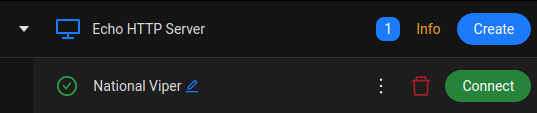

# Example

In this example, we are going to learn how to deploy a simple echo server using **golang**, which will answer to a **GET HTTP request** with a predefined message.

### Create the server

Create a **main.go** file with the following content to implement a simple HTTP server:

```go
import (
	"fmt"
	"net/http"
	"os"
)

// Write "Hello!" to the response body
func hello(w http.ResponseWriter, r *http.Request) {
	fmt.Fprintf(w, "Hello!\n")
}

func main() {
	port := os.Args[1] // use first arg to set port
	basepath := os.Args[2] // use second arg to set basepath
	http.HandleFunc(fmt.Sprintf("%s/", basepath), hello) // link function to url path
	panic(http.ListenAndServe(fmt.Sprintf("0.0.0.0:%s", port), nil)) // start the web-server
}
```

Let's test it by running it with `go run 8888 /hello`.

In the meanwhile open another terminal and launch the command `curl localhost:8888/hello`, and you will get `Hello!` as response.

### Build the container

Let's create a **Dockerfile** to build and package the HTTP server, and **copy/paste** the following code inside of it.

```Dockerfile
FROM golang:1.18
ENV CROWNLABS_LISTEN_PORT=8888 # Set the used port, once deployed in CrownLabs this variable will be overrided with the value used by CrownLabs
ENV CROWNLABS_BASE_PATH=/basepath # Set the web-service basepath, once deployed in CrownLabs this variable will be overrided with the value used by CrownLabs
COPY main.go main.go
RUN go build main.go
RUN useradd -ms /bin/bash myuser # Create a user with UID 1010
USER myuser # Use the previously created user to run the container
CMD exec ./main ${CROWNLABS_LISTEN_PORT} ${CROWNLABS_BASE_PATH}
```

Build the container with `docker build -t ${YOUR_DOCKERHUB_USERNAME}/echotest` and push it on **DockerHub** with `docker push ${YOUR_DOCKERHUB_USERNAME}/echotest`.

### Create the template

Create a file called **template.yaml** and **copy/paste** the following code:

```yaml
apiVersion: crownlabs.polito.it/v1alpha2
kind: Template
metadata:
    name: echotest
    namespace: workspace-sid # a workspace where you have the permission to create templates
spec:
    deleteAfter: never
    inactivityTimeout: 14d
    description: An http server used for testing
    environmentList:
        - environmentType: Standalone
          guiEnabled: true
          image: YOUR_DOCKERHUB_USERNAME/echotest
          mode: Standard
          name: default
          persistent: false
          resources:
              cpu: 1
              memory: 1000M
              reservedCPUPercentage: 50
          rewriteURL: false
    prettyName: Echo HTTP Server
    workspace.crownlabs.polito.it/WorkspaceRef:
        name: sid # choosen workspace name
```

And **apply** it with `kubectl apply -f template.yaml`

### Create an instance and try it

Open the **CrownLabs dashboard** and create a new instance.



Click on **connect** and you will see a `Hello!` message.

[Go back](../README.md)
